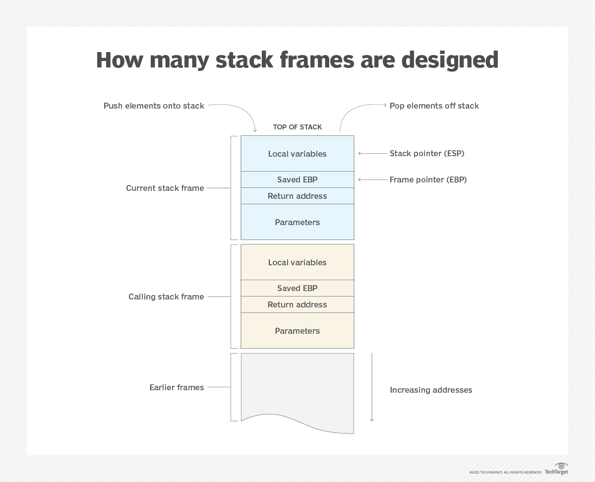

# Understand the Stack

**Reference:**
- https://hackingcpp.com/cpp/lang/memory_basics.html

------

    

### How does the stack pointer work?
Trước tiên, điểm qua một số thanh ghi có liên quan nhé!
- `EIP` (Extended instruction pointer): thanh ghi con trỏ lệnh, trỏ đến địa chỉ chứa lệnh tiếp theo sẽ được thực thi.
- `ESP` (Extended stack pointer): thanh ghi chứa địa chỉ đỉnh hiện tại của `stack`.
- `EBP` (Extended base pointer): thanh ghi trỏ đến một địa chỉ cố định trong một stack frame, thường là giá trị đầu tiên của stack frame, dùng làm tham chiếu để tính toán `offset` (độ dời) của các biến.
- `EAX` (Extended Accumulator Register): thanh ghi dùng cho nhập xuất và các lệnh tính toán số học.

    

